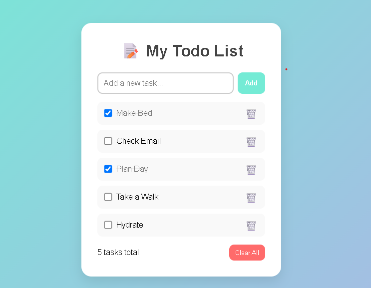

# 📝 Todo App (NSDA Assignment 12)
This is my first fully functional web project — a **Todo List App** built using **HTML**, **CSS**, and **JavaScript**.  
It was created as part of **NSDA Assignment 12**.

You can add tasks, mark them as complete, delete them, and your list stays saved even after refreshing — thanks to **localStorage**.

## 🌟 Preview

## 🚀 Features

✅ Add new tasks  
✅ Mark tasks as completed (checkbox + line-through)  
✅ Delete individual tasks  
✅ Clear all tasks  
✅ Saves data using `localStorage`  

## 🧩 Technologies Used

- **HTML5** – page structure  
- **CSS3** – design and layout  
- **JavaScript (ES6)** – functionality and localStorage  

## 💡 How to Use

1. Open the `index.html` file in your browser.  
2. Type your task in the input box.  
3. Click **Add** to save it to the list.  
4. Check the box ✅ to mark a task as complete.  
5. Click the 🗑️ button to delete one task.  
6. Use **Clear All** to remove everything.

## 📁 Project Structure

NSDA-Assignment-12/
│
├── index.html → main HTML file
├── style.css → all styling and colors
├── script.js → JavaScript logic (add, toggle, delete, save)
└── README.md → this file

---

## 🛠️ Future Improvements

🔹 Add **Edit** option for tasks  
🔹 Add **filters** (All / Completed / Pending)  
🔹 Add simple **animations** for smooth UX  

---

## 🧠 What I Learned

- How HTML, CSS, and JavaScript work together  
- How to use **localStorage** to save data  
- How to update the DOM dynamically with JS  
- How to organize a small front-end project  

---

## 👩‍💻 Author

**Name:** Liya Mehamed  
📅 **Date:** 25 October 2025  
📚 **Project:** NSDA Assignment 12  
🌐 **GitHub:** [https://github.com/Lia-Moh](https://github.com/Lia-Moh)

---

### ❤️ Thank you for viewing my first project!
Feel free to give feedback or suggestions for improvement!
